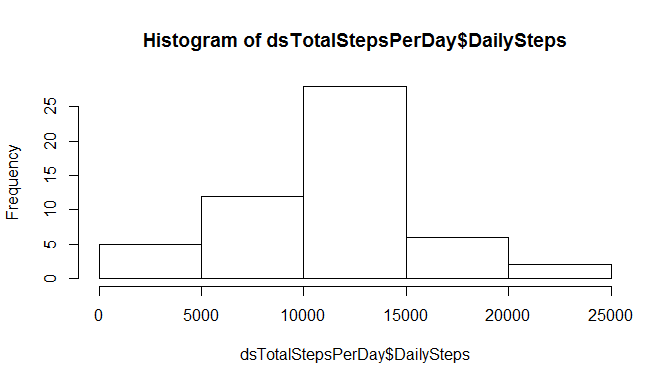
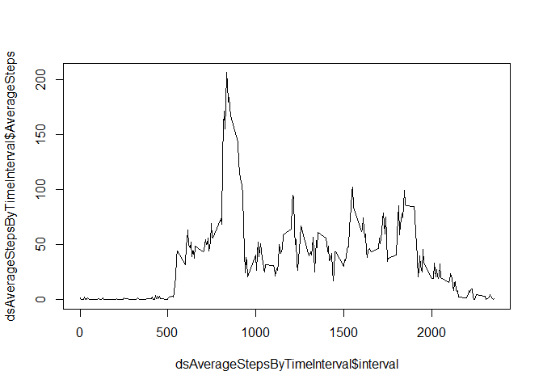
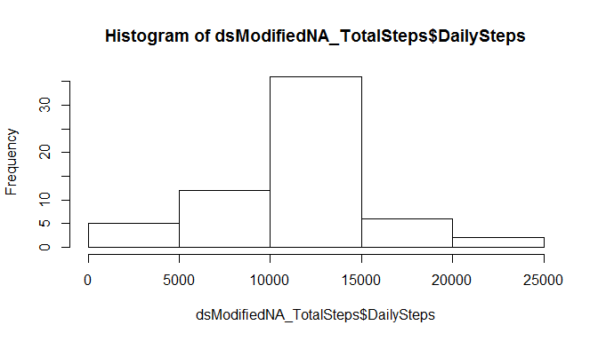
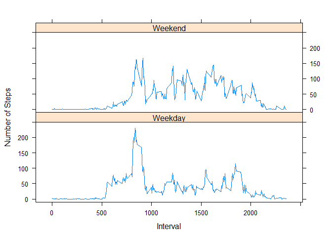

# Reproducible Research: Peer Assessment 1

## Loading and preprocessing the data
The code below is how I load the dataset into my ds variable.  The setwd() is used to set the working directory to the same directory as the github repository for this assignment. 

```r
setwd("C:/Users/bhoenig/Documents/GitHub/RepData_PeerAssessment1")

if(!file.exists("activity.csv")){
    unzip("activity.zip")
}

ds <- read.table("activity.csv", header=TRUE, sep=",", na.strings="NA", as.is=TRUE)
```

The data column initially is loaded as a character class, so I want to convert it to a date class.

```r
ds$date <- as.Date(ds$date)
```

This is what my data looks like.

```r
sapply(ds, class)
```

```
##     steps      date  interval 
## "integer"    "Date" "integer"
```

```r
head(ds)
```

```
##   steps       date interval
## 1    NA 2012-10-01        0
## 2    NA 2012-10-01        5
## 3    NA 2012-10-01       10
## 4    NA 2012-10-01       15
## 5    NA 2012-10-01       20
## 6    NA 2012-10-01       25
```

## What is mean total number of steps taken per day?
Here, the steps are summarize by date using the ddply() funtion in the plyr library:

```r
library(plyr)
dsTotalStepsPerDay <- ddply(ds, c("date"), summarise, DailySteps = sum(steps))

head(dsTotalStepsPerDay)
```

```
##         date DailySteps
## 1 2012-10-01         NA
## 2 2012-10-02        126
## 3 2012-10-03      11352
## 4 2012-10-04      12116
## 5 2012-10-05      13294
## 6 2012-10-06      15420
```

A histogram of the total steps per day can be useful for analysis.  This histogram shows a significant number of days are between 10000 and 15000 steps.

```r
hist(dsTotalStepsPerDay$DailySteps)
```

 

Calculating the mean and median can be done with the summary() function or individually with the median() and mean() function.

```r
summary(dsTotalStepsPerDay)
```

```
##       date              DailySteps   
##  Min.   :2012-10-01   Min.   :   41  
##  1st Qu.:2012-10-16   1st Qu.: 8841  
##  Median :2012-10-31   Median :10765  
##  Mean   :2012-10-31   Mean   :10766  
##  3rd Qu.:2012-11-15   3rd Qu.:13294  
##  Max.   :2012-11-30   Max.   :21194  
##                       NA's   :8
```

```r
median(dsTotalStepsPerDay$DailySteps, na.rm = TRUE)
```

```
## [1] 10765
```

```r
mean(dsTotalStepsPerDay$DailySteps, na.rm = TRUE)
```

```
## [1] 10766.19
```


## What is the average daily activity pattern (by time interval)?
We first summarize the data by the time interval and store it in the dsAverageStepsByTimeInterval variable.

```r
library(plyr)
dsAverageStepsByTimeInterval <- ddply(ds, c("interval"), summarise, AverageSteps = mean(steps, na.rm = TRUE))
```

We can show the dataset pattern with a line (type="l") plot.

```r
plot(dsAverageStepsByTimeInterval$interval, dsAverageStepsByTimeInterval$AverageSteps, type="l" )
```

 

To programatically find the interval with the max average steps, we sort the dataset by decending AverageSteps.  We use the head() function with the n=1 to return only one line.  The results is the 835 interval.

```r
head(dsAverageStepsByTimeInterval[order(-dsAverageStepsByTimeInterval$AverageSteps),], n=1)
```

```
##     interval AverageSteps
## 104      835     206.1698
```


## Imputing missing values
To count the total number of rows with missing data (NA), we can use the is.na() function.  This function returns 1 if true, so if we sum the results, then we get an accurate count of the rows with NA.

```r
sum(is.na(ds$steps))
```

```
## [1] 2304
```

An easier way to get the NA count is to use the summary() function.  It will give other useful data too.

```r
summary(ds)
```

```
##      steps             date               interval     
##  Min.   :  0.00   Min.   :2012-10-01   Min.   :   0.0  
##  1st Qu.:  0.00   1st Qu.:2012-10-16   1st Qu.: 588.8  
##  Median :  0.00   Median :2012-10-31   Median :1177.5  
##  Mean   : 37.38   Mean   :2012-10-31   Mean   :1177.5  
##  3rd Qu.: 12.00   3rd Qu.:2012-11-15   3rd Qu.:1766.2  
##  Max.   :806.00   Max.   :2012-11-30   Max.   :2355.0  
##  NA's   :2304
```


To populate the missing data, we are going to use the mean for the given interval that were calculated previously and stored in dsAverageStepsByTimeInterval.

I will merge the original dataset (ds) with the summarized dataset (dsAverageStepsByTimeInterval).  

```r
dsMerge <- merge(ds, dsAverageStepsByTimeInterval)
head(dsMerge)
```

```
##   interval steps       date AverageSteps
## 1        0    NA 2012-10-01     1.716981
## 2        0     0 2012-11-23     1.716981
## 3        0     0 2012-10-28     1.716981
## 4        0     0 2012-11-06     1.716981
## 5        0     0 2012-11-24     1.716981
## 6        0     0 2012-11-15     1.716981
```

Now, we can update the missing values in steps with the AverageSteps value.  Then create a new dataset (dsModifiedNA) with specific columns.

```r
dsMerge[is.na(dsMerge$steps),]$steps <- dsMerge[is.na(dsMerge$steps),]$AverageSteps

dsModifiedNA <- dsMerge[, c("steps", "date", "interval")]
head(dsModifiedNA)
```

```
##      steps       date interval
## 1 1.716981 2012-10-01        0
## 2 0.000000 2012-11-23        0
## 3 0.000000 2012-10-28        0
## 4 0.000000 2012-11-06        0
## 5 0.000000 2012-11-24        0
## 6 0.000000 2012-11-15        0
```

To create a histogram, we'll need to first summarize the steps in the new dataset by date.

```r
library(plyr)
dsModifiedNA_TotalSteps <- ddply(dsModifiedNA, c("date"), summarise, DailySteps = sum(steps))
```

A histogram of the total steps per day changes because the 8 days with missing data now have values.  Since these 8 days were given the mean value (10766), there are 8 more entries in the 10000 to 15000 area.

```r
hist(  dsModifiedNA_TotalSteps$DailySteps)
```

 

When calculating the mean and median from the new dataset, the only change is in the median.  

```r
mean(dsModifiedNA_TotalSteps$DailySteps) 
```

```
## [1] 10766.19
```

```r
mean(dsTotalStepsPerDay$DailySteps, na.rm = TRUE)
```

```
## [1] 10766.19
```

```r
median(dsModifiedNA_TotalSteps$DailySteps)
```

```
## [1] 10766.19
```

```r
median(dsTotalStepsPerDay$DailySteps, na.rm = TRUE)
```

```
## [1] 10765
```


Since our approach replaced missing data with it's corresponding mean values, we are overweighting the center of our data and causing the median to equal our median.  This can best be seen when comparing the two summary() data.  

```r
summary(dsModifiedNA_TotalSteps)
```

```
##       date              DailySteps   
##  Min.   :2012-10-01   Min.   :   41  
##  1st Qu.:2012-10-16   1st Qu.: 9819  
##  Median :2012-10-31   Median :10766  
##  Mean   :2012-10-31   Mean   :10766  
##  3rd Qu.:2012-11-15   3rd Qu.:12811  
##  Max.   :2012-11-30   Max.   :21194
```

```r
summary(dsTotalStepsPerDay)
```

```
##       date              DailySteps   
##  Min.   :2012-10-01   Min.   :   41  
##  1st Qu.:2012-10-16   1st Qu.: 8841  
##  Median :2012-10-31   Median :10765  
##  Mean   :2012-10-31   Mean   :10766  
##  3rd Qu.:2012-11-15   3rd Qu.:13294  
##  Max.   :2012-11-30   Max.   :21194  
##                       NA's   :8
```


## Are there differences in activity patterns between weekdays and weekends?
Yes, there are difference in the activity patterns between weekdays and weekends.

We first want to add a new column that contains the values "weekday" and "weekend"

```r
dsModifiedNA$WeekPart <- as.factor(ifelse(weekdays(dsModifiedNA$date) %in% c("Saturday","Sunday"), "Weekend", "Weekday"))

sapply(dsModifiedNA, class)
```

```
##     steps      date  interval  WeekPart 
## "numeric"    "Date" "integer"  "factor"
```

```r
head(dsModifiedNA, n=20)
```

```
##        steps       date interval WeekPart
## 1   1.716981 2012-10-01        0  Weekday
## 2   0.000000 2012-11-23        0  Weekday
## 3   0.000000 2012-10-28        0  Weekend
## 4   0.000000 2012-11-06        0  Weekday
## 5   0.000000 2012-11-24        0  Weekend
## 6   0.000000 2012-11-15        0  Weekday
## 7   0.000000 2012-10-20        0  Weekend
## 8   0.000000 2012-11-16        0  Weekday
## 9   0.000000 2012-11-07        0  Weekday
## 10  0.000000 2012-11-25        0  Weekend
## 11  1.716981 2012-11-04        0  Weekend
## 12  0.000000 2012-11-08        0  Weekday
## 13  0.000000 2012-10-12        0  Weekday
## 14  0.000000 2012-10-30        0  Weekday
## 15  0.000000 2012-11-26        0  Weekday
## 16 47.000000 2012-10-04        0  Weekday
## 17  0.000000 2012-11-27        0  Weekday
## 18  0.000000 2012-10-31        0  Weekday
## 19  0.000000 2012-11-18        0  Weekend
## 20  0.000000 2012-10-05        0  Weekday
```

Prior to comparing the data with a plot we need to  summarize the data by the time interval 

```r
library(plyr)
dsModifiedNA_AverageStepsByTimeInterval <- ddply(dsModifiedNA, c("WeekPart", "interval"), summarise, AverageSteps = mean(steps))
```

We can compare the weekend vs weekday by stacking two plot that are split by the WeekPart factor.

```r
library(lattice)
xyplot(AverageSteps~interval | factor(WeekPart), data=dsModifiedNA_AverageStepsByTimeInterval, ylab="Number of Steps", xlab="Interval", type="l", layout=c(1,2), ylim=c(-10,250))
```

 

